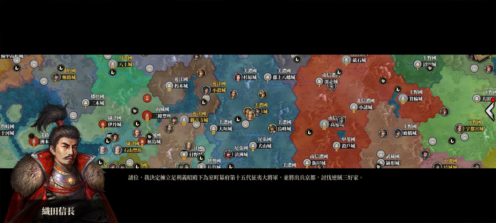
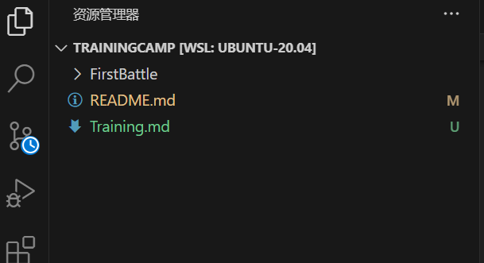
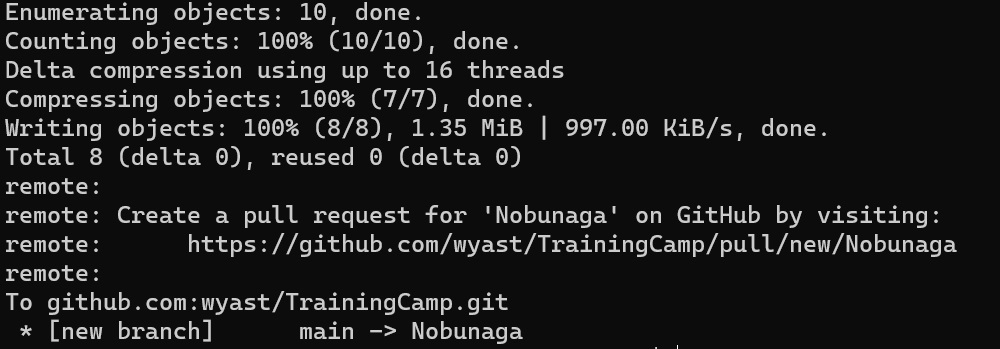

# 未央学术部 Git 训练手册

你好，我是织田信长。现在我来教你如何成为战国乱世中的一方枭雄。为了成为枭雄你肯定需要一个团队，正如我有“织田五大将”；而有了团队就有必要使用 Git。所以，请务必乖乖地跟我学好 Git。  
为了让你信任我，在此放一张帅照。  

**在使用训练营之前，确保你已经完成了以下事情：**

1. 阅读了“语雀”上的 Git 入门教程
2. 学会了“狂神说 Git”的内容
3. 通关了 GitHub WorkFlow 训练营
4. 已经成为 GitHub/wyast 公司的成员

    具体的信息都在语雀上。如果你没有打牢基础而来我这儿瞎搞，我会深入而友好地一对一教育你。

## 初始化

#### 新建目录

打开你的 win Git 或者 Linux，在你喜欢的位置创建你的科协工作目录。

    mkdir wyast
    cd wyast

#### 配置账户

配置你的 Git 账户和密码。注意这里必须是你在 wyast 公司里的账户，否则无法 push。

    git config --global user.name "你GitHub的用户名"
    git config --global user.email "你GitHub的注册用邮箱"

#### 配置密钥

这是一门学问，在此不便细说。好在 CSDN 上有一个很好的攻略，聪明的你一定能学会。  
<a href="https://blog.csdn.net/Yaoyao2024/article/details/132123525">SSH Key 教程</a>

#### 初始化仓库

执行以下命令以获得本训练营的仓库：

    git clone git@github.com:"wyast"/"TrainingCamp".git

执行`ls`命令可以看到出现`TrainingCamp`目录。现在打开此工作目录。

    cd TrainingCamp
    code .

你现在能看到类似这样的右边栏：  

到此处，你已经顺利完成初始化了。

## 获取进度

从远程 GitHub 库中拉取同事们的进度，覆盖本地文件。

    git pull origin main

这在工作中很重要，可以避免很多的合并冲突。注意，在实际工作中，不一定拉取 main 分支，将 main 替换成你想要的远程分支即可。

## 写文件

现在需要你写一个文件，这将是你的初阵，作为“合作中你的部分”的模拟。在 FirstBattle 目录下新建一个文件，修改文件名及后缀成为`YourName.cpp`。**YourName 处一律填入你的拼音/英文名/代号/昵称任选其一，不要与他人重复。**  
点击 YourName.cpp，输入以下内容并 ctrl s 保存。

    # include <stdio>

    int main()
    {
    printf("Hello World! I am YourName\n");
    return 0;
    }

## 创建分支并完成 Push

现在你对团队的代码有了自己的贡献，需要把新的代码包推回远端仓库。但是工作时，远端仓库的 main 分支被我织田信长上了锁，避免大家可能的误操作而给团队带来不必要的麻烦。所以，你现在需要 push 到一个分支上，再要求老人们合并。

    git add .
    git commit -m "YourName's first battle !!"
    git push origin main:YourName

看到类似于这样的信息，说明你成功了。这个`YourName`分支是你的专属工作区。正式工作时可以取与你正在做的功能有关的名字，比如“latex”。

而如果显示“Permission Denied”，说明是初始化有问题，检查你配置的 user.email 是否是你在 wyast 中的那个 GitHub 账号的注册用邮箱。

## 提出 Pull Request

打开 GitHub 网页，点击 `Compare & pull request` 。

注意：在实际工作中，你不应该对每一个 commit 都提交 pull request，很低效。需要在累积了足够多的改动（比如新建并完成了一个网页）后几次 commit 统一 pull request。

按照你在 WorkFlow 教程中学习的方法提出申请。勾选所有的 Owner，确认。最后请在大群里说一声，老人们来看这个 request。

## 恭喜

你完成了教程，从现在起你应该熟悉了我们部门的标准工作流。掌握了 Git，你可以开始团队合作了。祝你在成为一代枭雄的路上诸事如意。信长告退。
